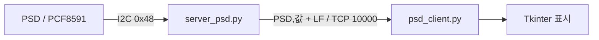

# Raspberry Pi 제어·센서 실습

GPIO 모터·스위치, I2C 센서와 LCD, TCP 통신, 카메라 분류를 각각 실행하는 임베디드 수업 코드.

## 확인할 실습

| 주제 | 파일 | 동작 |
|---|---|---|
| 모터와 입력 | `DCMotor.py`, `servo_motor.py`, `stepmotor.c`, `switch*.py` | GPIO 출력·PWM·스위치 입력 |
| 룰렛 | `roulette_game.py` | Tkinter 화면, 스텝 모터, ADC 속도 입력, LCD, 위치 파일 |
| 거리 센서 통신 | `server_psd.py`, `psd_client.py` | I2C ADC 읽기 → 거리 계산 → TCP 전송/표시 |
| 기본 TCP | `server.py`, `client.py`, `chat_server.py`, `chat_client.py` | echo와 채팅 실습 |
| 카메라 분류 | `apple_banana.py`, `mytf_example_cam*.py` | OpenCV 프레임 → 224×224 정규화 → Keras 추론 |
| 오디오 | `mic.py`, `speaker.py` | 녹음·재생 |

하나의 통합 서버나 REST API가 아니라 장비별 독립 스크립트다. `RPi.GPIO`·`smbus`·I2C LCD는 Raspberry Pi 환경을 요구한다. 카메라 코드는 TensorFlow/Keras, NumPy, Pillow, OpenCV를 사용하고 GUI는 Tkinter로 구성한다.

## 데이터가 이동하는 예



`server_psd.py`는 ADC 값을 전압으로 바꾸고 식을 적용해 거리값을 보낸다. 파일별 protocol·핀·모델·주소는 [하드웨어와 통신 메모](docs/HARDWARE_AND_PROTOCOL.md)를 본다.

## 실행 조건

Raspberry Pi에서 I2C/GPIO 장치와 실제 배선을 확인하고 해당 스크립트를 저장소 루트에서 실행한다. 예를 들어 룰렛은 다음 entry를 사용한다.

```bash
python3 roulette_game.py
```

이 명령은 모터와 LCD를 초기화하므로 장비 없이 실행하는 데모가 아니다. 모델·라벨·위치 파일 일부를 현재 작업 디렉터리에서 읽는다. 공통 requirements나 고정 버전 환경은 없으며 모든 스크립트를 한 번에 설치·실행하는 절차는 제공하지 않는다.

`client.py` 등의 상대 IP와 카메라 stream URL은 코드 상수다. 환경변수 설정으로 변경할 수 있다고 가정하지 않는다. 기존 모델 파일은 있지만 학습 pipeline·정확도 측정·자동 테스트·배포 구성은 포함되어 있지 않다.
